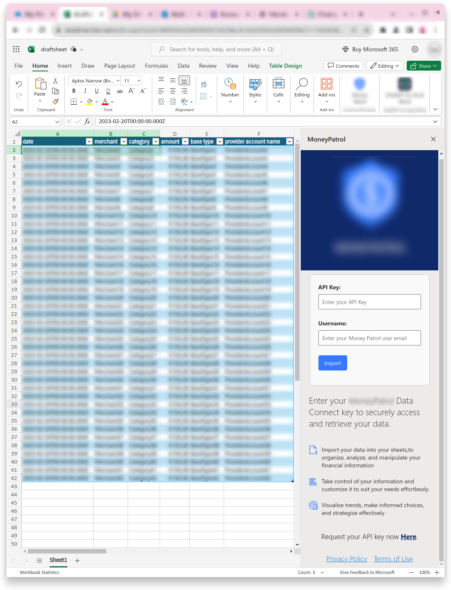

# RealLife Add-ins
RealLife Add-ins project: These add-ins have been developed for real-life use and are published for actual users.

## Banking Data Add-ins
### Google Add-on and Microsoft Add-in
Both are designed to allow users to interact with their financial information (retrieve and manipulate their banking data in their working Sheets) using their API key and username.

### Features:

- Import banking data into  Sheets.
- Organize and analyze financial information effortlessly.
- Utilize API key and username for secure data access.
Microsoft Add-in

### Both add-ins include:

- Developed endpoints with Auth middleware.
- Node.js controller to retrieve user data from target tables.
- Compatibility with both Google Sheets and Microsoft Excel environments.
- Future Features

The project is actively in the development phase, with additional features planned for implementation. Updates will be added to the GitHub repository upon customer approval.

## Google Docs QA Solution
In the "google-doc" folder, you'll find a solution developed for a work team of 30 persons involved in QA. The challenge was inconsistency in feedback, including unclear phrases and grammar issues. To address this, a solution was created:
[Watch Demo](googledoc/demo/feebacktool.GIF)

### Problem:

- Inconsistent feedback language.
- Time spent elaborating and reviewing grammar.

###  Solution:

- Standardized phrases added to a Google Sheet.
- Sheet used to generate dropdown modules and QA phrases.
- Team inserts standard phrases into feedback.
- New common problems added to the sheet for immediate QA availability.

###  Results:
- Time saved.
- Improved QA clarity.

This tool has been in use for put in use October 15th 2023 and is deployed internally for the customer team's benefit. For more details, refer to the respective folders in the repository.

Thank you for exploring RealLife Add-ins! Feel free to reach out if you have any questions or feedback.
